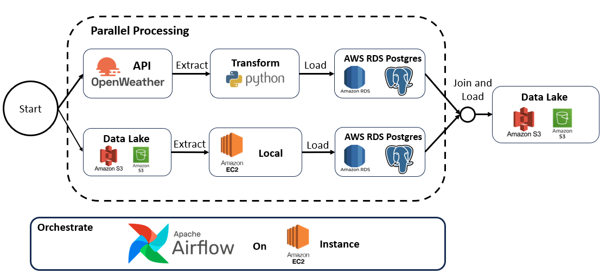
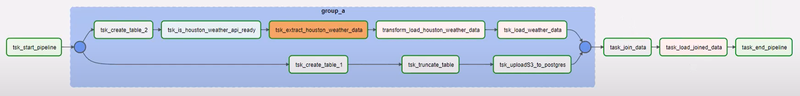

# Weather Data Pipeline

This project implements an automated ETL pipeline that collects weather data from OpenWeather API and combines it with city demographic information. The pipeline is orchestrated using Apache Airflow on AWS EC2, with data stored in AWS RDS PostgreSQL and Amazon S3.

## Architecture
The pipeline follows an ETL (Extract, Transform, Load) architecture with parallel processing:

1. **Extract**: Data is sourced from two locations:
   - OpenWeather API for current weather conditions
   - Amazon S3 bucket containing city demographic information

2. **Transform**: Raw data is processed to:
   - Convert temperature from Kelvin to Fahrenheit
   - Format timestamps for record time, sunrise, and sunset
   - Structure data for database storage

3. **Load**: Processed data is loaded into:
   - AWS RDS PostgreSQL database (primary storage)
   - Joined results are exported to Amazon S3 (data lake)

## Key Components

### Data Sources
- **OpenWeather API**: Provides current weather data including temperature, pressure, humidity, and wind speed
- **S3 Bucket (airflow-weather-bucket)**: Contains city demographic data (population, land area)

### Processing
- **Apache Airflow**: Orchestrates the entire workflow with task dependencies
- **Python**: Handles data transformation using Pandas and boto3
- **PostgreSQL**: Stores and joins the datasets

### Storage
- **AWS RDS PostgreSQL**: Stores weather data and city information in separate tables
- **Amazon S3**: Stores the final joined dataset with timestamp in filename

## Implementation Workflow
The Apache Airflow DAG (`weather_dag.py`) coordinates the following tasks:

1. **Data Retrieval**:
   - Extract weather data (temperature, humidity, wind speed) from OpenWeather API
   - Simultaneously retrieve city demographic information from S3 bucket

2. **Data Transformation**:
   - Process OpenWeather API JSON responses and convert to structured format
   - Use Pandas to transform data (temperature conversion, timestamp formatting)
   - Generate CSV files for efficient database loading

3. **Parallel Processing**:
   - **City Data Path**: S3 → EC2 → PostgreSQL
   - **Weather Data Path**: OpenWeather API → Transform → PostgreSQL

4. **Data Integration**:
   - Load both datasets into AWS RDS PostgreSQL tables
   - Enrich weather data by joining with city demographic information
   - Export combined results to S3 with timestamp in CSV format

5. **Pipeline Orchestration**:
   - Apache Airflow on EC2 coordinates the entire workflow
   - Tasks run in parallel where possible for efficiency
   - Automated daily execution with failure handling

### DAG Structure 
The workflow uses Airflow's TaskGroup for parallel processing, with dependencies ensuring proper execution order

### Database Tables
  - `weather_data`: Stores processed weather information
  - `city_look_up`: Contains city demographic data

### Database Schema

#### `weather_data` Table
- city (TEXT)
- description (TEXT)
- temperature_farenheit (NUMERIC)
- feels_like_farenheit (NUMERIC)
- minimun_temp_farenheit (NUMERIC)
- maximum_temp_farenheit (NUMERIC)
- pressure (NUMERIC)
- humidity (NUMERIC)
- wind_speed (NUMERIC)
- time_of_record (TIMESTAMP)
- sunrise_local_time (TIMESTAMP)
- sunset_local_time (TIMESTAMP)

#### `city_look_up` Table
- city (TEXT)
- state (TEXT)
- census_2020 (INT)
- land_area_sq_mile_2020 (NUMERIC)

## Technical Details
- Python functions handle data transformation and S3 interactions using boto3
- PostgreSQL operators manage database operations
- HTTP operators retrieve data from OpenWeather API
- Error handling with configurable retries (2 retries with 2-minute delays)

## Running the Pipeline
- Configure Airflow connections for PostgreSQL and OpenWeather API
- Ensure S3 bucket access with proper IAM permissions
- DAG runs daily with automatic retries on failure

## Conclusion
This weather data pipeline demonstrates an efficient approach to collecting, processing, and storing weather information alongside demographic data. By leveraging OpenWeather API for current conditions and combining it with city demographic data, the pipeline creates a comprehensive dataset suitable for various analytical purposes.

The implementation showcases several key data engineering practices:
- Parallel processing for improved efficiency
- ETL patterns with clear separation of extraction, transformation, and loading
- Cloud-based infrastructure using AWS services (EC2, RDS, S3)
- Workflow automation with Apache Airflow
- Data enrichment through relational database joins

The resulting architecture is both scalable and maintainable, offering a foundation that can be extended to support additional data sources, implement quality checks, or power visualization dashboards for deeper insights into weather patterns across different cities.
